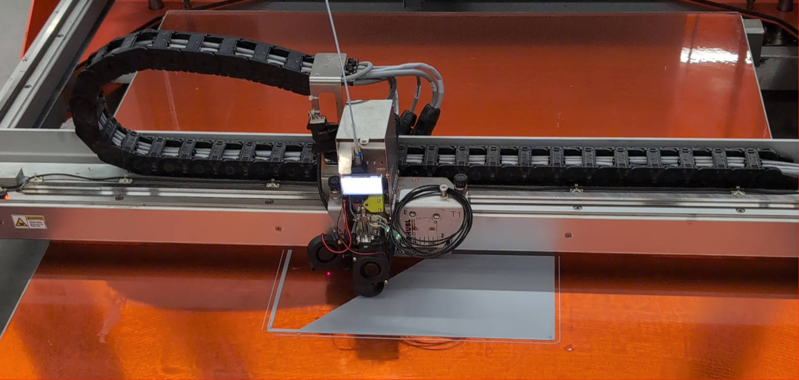
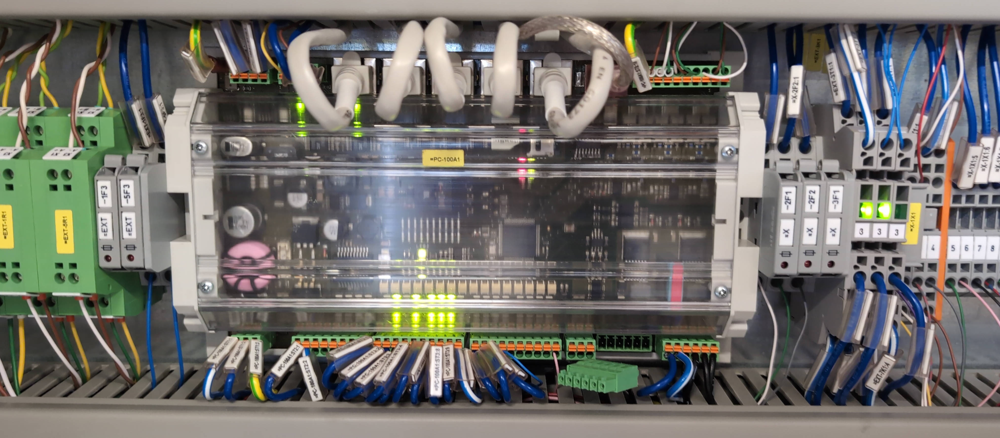
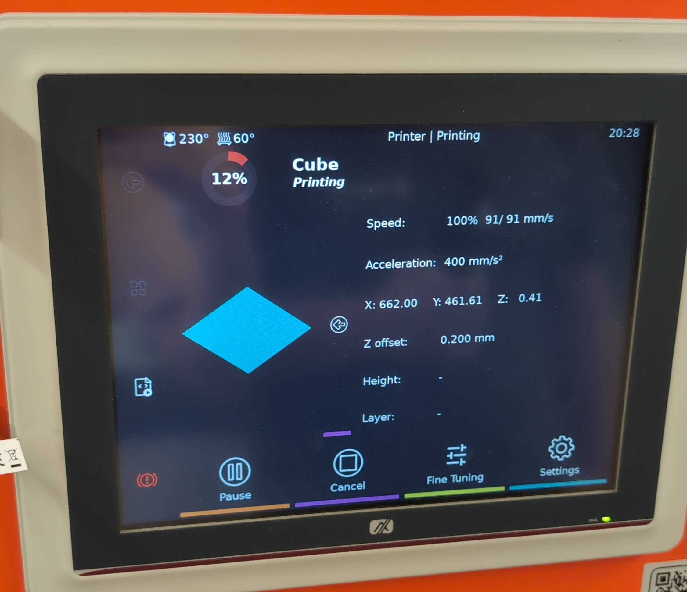
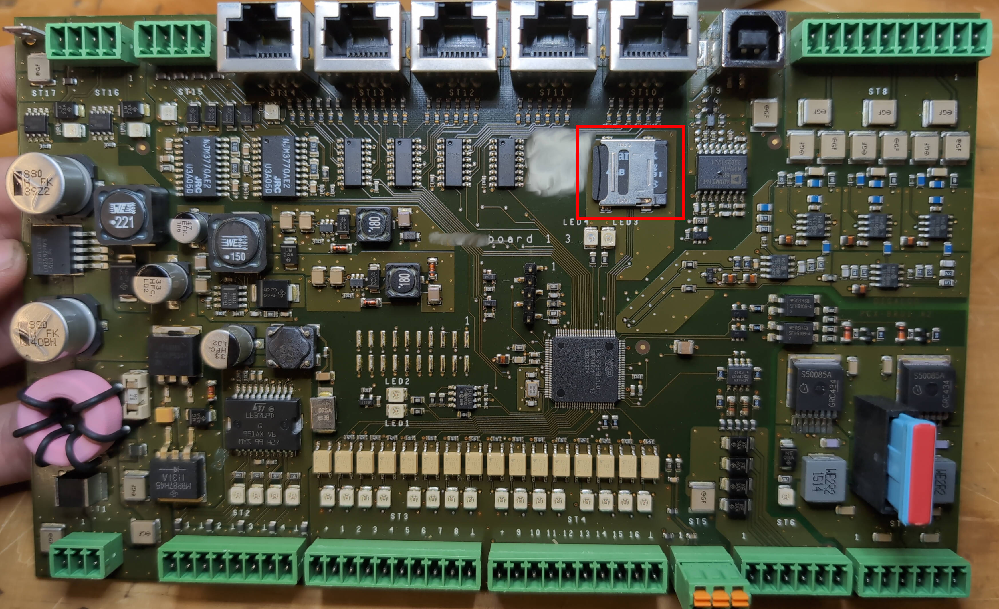
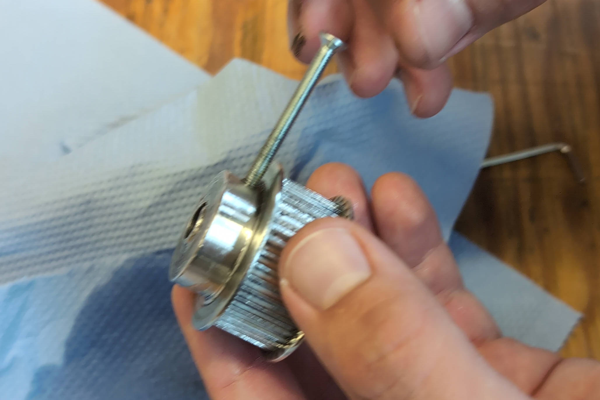
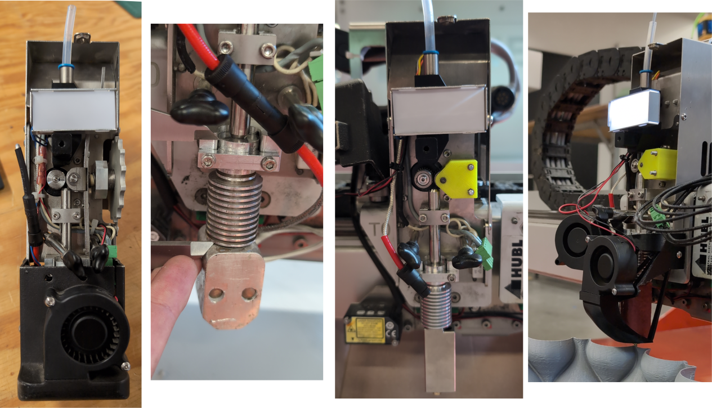
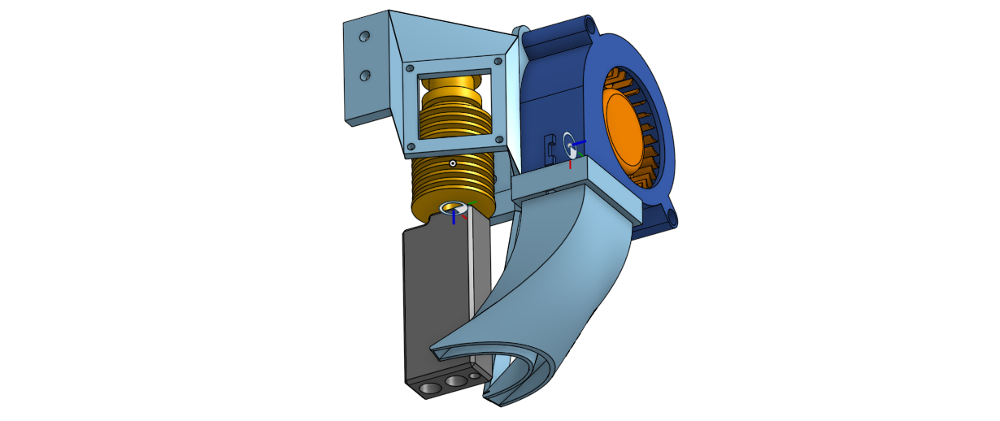

+++
title = 'BigRep Modding Klipper'
date = 2024-09-17T16:16:36+02:00
+++



Having the opportunity to fix and modernize a large format 3d-printer at my local makerspace sounds like a cool challenge! Especially when it's about a professional printer (with a professional pricetag) that you usually don't have access to as a hobbyist.
The exact type of this printer model is unknown to me, but it is some early version of the `BigRep ONE`, probably a `BigRep ONE.3b` manufactured in 2016 or so.
With this write-up I want to briefly document the process of fixing and modifying this machine. This project only succeeded thanks to the amazing Tinkerers involved, helping out with their expertise and creativity.

## Investigating the BigRep ONE


While the newer BigRep machines come shipped with a Windows embedded computer (apparently for some motor driver compatibility reasons...) the printer I'm working on still had LUbuntu 16.04 installed.
This Computer is connected via USB to a so called `BoogieBoard` which is BigRep's modified version of the OpenSource [SmoothieBoard](https://smoothieware.github.io/smoothieware-website-v1//smoothieboard-v1).
To be specific, the board in this printer had the version `Boogieboard 1 3`. The MCU does not have any stepper drivers mounted but rather sends pulses/direction signals to the external drivers (wired using the RJ45 ports).
For motion in XYZ, drivers of type `Leadshine DM556` are used, while it's a `Leadshine DM442` for the extruders each.

The root password for the Linux Computer is written in the service protocol, that's great! The frontend on this PC is just a modified OctoPrint with the capability to update the modified SmoothieWare firmware running on the Boogieboard.

### Extruder
This BigRep is equipped with two extruders for 2.85mm wide filament which can be individually raised or lowered by a linear actuator. The temperature sensor is a `3-wire pt100`. 
They used the heat sink from a V6 hotend and added a custom aluminium heatblock with two 24V-50W heater elements in parallel. The nozzle is a standard volcano nozzle. Heatblock and heatsink are connected using a custom heatbreak which reaches really long into the heatblock - not optimal.

## Installing Klipper on PC
I went for a fresh install of Debian for the existing embedded computer. Since Klipper is usually run on RaspberryPis, the default username is usually 'pi'. That is also what I went for with this installation.
Once Debian was running, the [KIAUH](https://github.com/dw-0/kiauh) installer did the rest.



## Preparing Klipper for the BoogieBoard
With the BoogieBoard being based on the Smoothieboard, the Klipper firmware configuration can be directly copied from the latter.
I ended up configuring Klipper as following with `make menuconfig`: 
```
Micro-controller Architecture -> LPC176x (Smoothieboard)
Processor model -> lpc1769 (120 MHz)
Bootloader offset -> 16KiB bootloader (Smoothieware bootloader)
Communication interface -> USB
```

After that we can compile Klipper and get a binary file `klipper.bin` that we later rename to `firmware.bin`.


## Flashing MCU
The usual flashing procedure for SmoothieBoards is to place a `firmware.bin` file on the sd card which gets renamed to `firmware.bin` after successful flashing. However, BigRep modified the bootloader in such a way so that a matching `firmware.inf` file is required in addition to the `firmware.bin`.
This file only contains a CRC16-XMODEM checksum of the binary file and can be calculated using the following script.

```python
#!/usr/bin/env python3
"""
Calculates the crc value of a given file. Uses crc16 library: https://pypi.python.org/pypi/crc16/0.1.1


modified by Sandro Pischinger on 31.5.2024
    - set seed to 0xFFFF (default)
    - remove unused blocksize
    - use binascii
"""
import struct
import argparse
import binascii

def main():
    parser = argparse.ArgumentParser(description="Calculate CRC for a given file")
    parser.add_argument('filename', help="The binary file to calculate the CRC for")
    parser.add_argument('-f', '--info_file', help='Output file for firmware metadata')

    args = parser.parse_args()

    with open(args.filename, "rb") as f:
        binData = f.read()

    crc = binascii.crc_hqx(binData, 0xFFFF)
    print(f"CRC overall: 0x{crc:04x}")

    if args.info_file:
        with open(args.info_file, "wb") as finfo:
            finfo.write(struct.pack(">H", crc))


if __name__ == '__main__':
    main()
```

For flashing turn off the BigRep and unscrew the cover for the BoogieBoard. You should see a sd card(-holder) on the PCB right next to the bigrep logo. Place your thumb on the metal holder and gently push it to the right in order to open it. You can now remove the sd card and progress with placing the `firmware.bin` and matching `firmware.inf` file on the sd-card using a computer.
Then insert the sd card back into the BoogieBoard and power up the machine. The firmware should now be flashed. You can confirm by either connecting to UART and check the debug output or inspect the `firmware.cur` file on the sd-card and compare it to your freshly compiled `firmware.bin`.



Once Klipper is flashed, the future flashing progress might be simplified by making use of Klipper's [SDCard updates](https://www.klipper3d.org/SDCard_Updates.html) feature.

## Mechanical Issues


This BigRep had some strange layer shifts on the X-Axis. And with 'strange' I mean that the shift only appeared sometimes and always in the range of +/- 0.5cm of the original path.
After a lot of troubleshooting I figured that this is caused by a loose setscrew at the pulley of the X-Stepper. Apparently BigRep didn't use a key for connecting the two. Thus there was a lot of stress on the set screw which got loose after time. Inserting a key with some threadlocker for the screw fixed this issue. Furthermore I drilled a hole in the X-Gantry for easy access of this setscrew. 

There were also some part failures in the electrical enclosure. One contactor was stuck due to a bad spring, and some of the fuses were blown. Those were simply replaced. No modifications were made to the electrical enclosure and its insides.

## Hardware Modifications



I decided to convert the existing hotend to a dual-drive extruder with an [E3D SuperVolcano](https://e3d-online.com/products/supervolcano-upgrade-kit). While redesigning the fan-duct, a blower fan was added as hotend fan. 
For the conversion, the `Bondtech driver gear kit` was used along with a 3d-printed mount. The motor shaft had a smaller diameter than the new gears, thus an adapter was needed to be machined at the lathe.



## Enclosure

The material used for printing is almost exclusively PLA. Thus an encloser is usually not needed as PLA Printing does not require high chamber temperatures. But what does affect PLA prints are wind gusts from an open window. This is why the sides of the printer need to be closed, ideally with some transparent material like PP or Acryl. An adapter plate was cut out of 3mm steel, powder coated and installed with a 3d-printed hinge.


## Future Plans

There are some plans for further improvements of this machine. Some of which involve installing a CANBUS system, eliminating the need for all those wires going to the toolheads. Also, having a toolhead for 1.75mm filament would be cool. Ideally with a modern extruder and hotend. Of course, there need to be a lot of RGB leds installed, maybe also a loudspeaker in order to give this machine a voice. The speed of the X- and Y-Axis are limited by the stepper drivers; The time delay between two step impulses may not be shorter than five microseconds. This leaves us a maximum printing speed of ~100mm/s.
